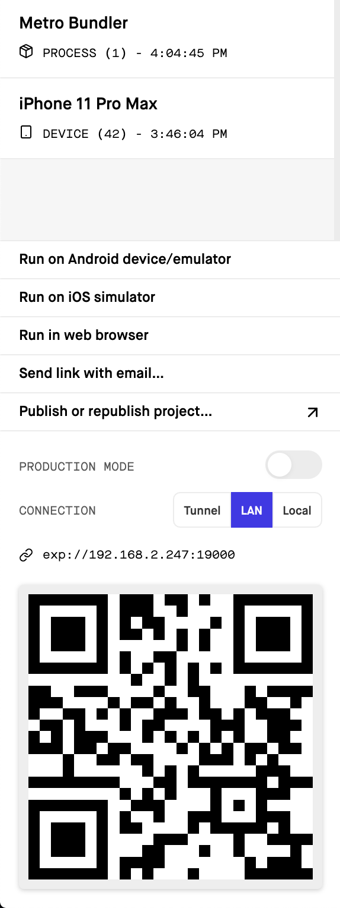

# rn-todo-app

CRUD операции над заданиями. Запросы выполняются к сервису Firebase. Есть экраны со списком заданий, конкретным заданием, модальное окно с редактированием задания.

Данные обрабатываются с помощью mobx.

### Запуск приложения

Для старта приложения необходимо ввести команду

```npm start```

Откроется веб страница на адресе

[http://localhost:19002/](http://localhost:19002/)

примерно такого вида



Чтобы запустить на IOS симуляторе, на компьютере должна быть установлена программа XCode. Если такая программа есть, можно нажать на кнопку

```Run on IOS simulator```

Чтобы запустить на Android симуляторе, на компьютере должна быть установлена программа Android studio. Если такая программа есть, можно нажать на кнопку

```Run on Android device/emulator```

Можно также запустить на своем телефоне, для этого нужно скачать приложение Expo Go

[App Store](https://apps.apple.com/app/expo-client/id982107779)

[Play Market](https://play.google.com/store/apps/details?id=host.exp.exponent)

Запустив приложение Expo Go, нужно навести камеру на QR код. Если телефон подключен к wi-fi сети, отличной от компьютера,
нужно перевести ```Connection``` в статус ```tunel```.
